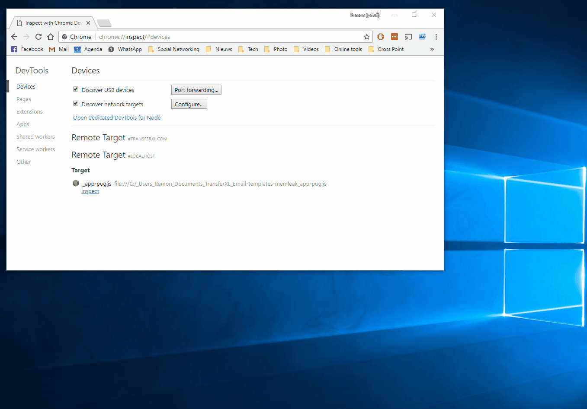
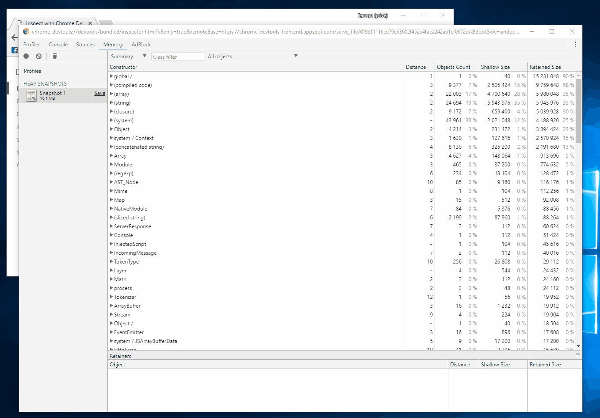

# [**PUG memory leak demonstrator**](https://github.com/ramondeklein/pug-memleak)

> Sample program to illustrate the memory leak in the [pug](https://github.com/pugjs/pug) library.
> It is also affecting the [email-templates](https://github.com/niftylettuce/email-templates)
> library.

## How to use

This program sole purpose is to demonstrate the memory leak in [pug][]. Hopefully, it
can be used to track down the memory leak by the development team. I tried to keep this example
program as simple as possible to reduce chances of bugs from other places.

To demonstrate the problem first start this example program:
```sh
npm install
node --inspect app-pug.js
```

This will start the program and starts listening for requests on port 3000. Upon every request a
template is rendered and returned to the caller. Such a call can be invoked using:
```sh
curl http://localhost:3000/
```

## What I think is wrong...

It seems that PUG is generating Javascript based on the PUG template. This Javascript is compiled
and kept in memory. When another request is coming in, then it generates Javascript again,
compiles it and keeps this method in memory again. I am not sure if this is a bug in NodeJS
garbage collector (I am using NodeJS v8.9.4), because the function isn't reachable and could have
been collected.

The fix is obvious and that is to re-use the generated function. In the sample application, you
can set the `useGlobalTemplateFunc` flag, so it reuses the method.

## Demonstration

The following demonstrations shows what is going on. Let's fire up our demo application and
invoke the first request:

```sh
node --inspect app-pug.js
curl http://localhost:3000
```

It returns the expanded template, so the application seems to work fine. Now start Chrome and
navigate to [chrome://inspect](chrome://inspect). You should see our `app-pug.js` in the list
of targets. Start inspecting it and generate the first snapshot dump.



We'll now invoke the request another 4 times:

```sh
curl http://localhost:3000
curl http://localhost:3000
curl http://localhost:3000
curl http://localhost:3000
```

Generate another snapshot and compare it with the first snapshot. It's clearly visible that it has
generated four new closures that hold the Javascript code for the template method.



## The issue with email-templates

This library is also used by [email-templates](), but it requires to specify the template file and
it will do its magic on its own. It seems that it recompiles the template over and over again,
causing a memory leak. I demonstrated it using the [app-email-templates.js](app-email-templates.js)
test application that can be used in the same way as the PUG example.
